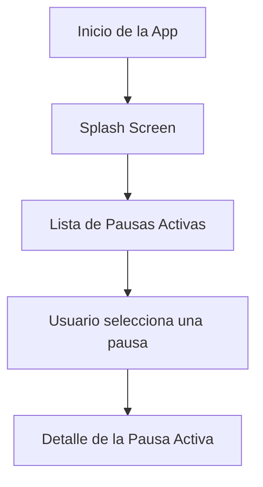

# Active Breaks Mobile

## Descripción del proyecto
ActiveBreaks Mobile es una aplicación de productividad orientada a trabajadores y estudiantes que realizan actividades prolongadas frente a pantallas y requieren incorporar pausas activas durante su jornada laboral o de estudio.
Muchas personas pasan demasiado tiempo sin pausas activas, lo que puede provocar fatiga física y mental. Esta aplicación propone una solución móvil que permite visualizar una lista de pausas activas recomendadas y acceder al detalle de cada una de ellas de forma rápida e intuitiva.

El proyecto corresponde a una maqueta funcional programada en Flutter, cuyo objetivo es representar el caso de uso principal aplicando el patrón de diseño lista-detalle y una navegación clara a través de su interfaz.

## Características propias del móvil
- Uso de listas con desplazamiento vertical.
- Interfaz optimizada para interacción táctil.
- Acceso rápido desde el dispositivo.

## Requerimientos

### Historias de usuarios
- Como trabajador, cuando estoy en mi jornada laboral, quiero ver una lista de pausas activas, para elegir la que mejor se ajuste a lo que necesito en ese momento.

- Como usuario, cuando selecciono una pausa activa, quiero ver su detalle, para entender qué ejercicio realizar y cuánto tiempo me tomará.

- Como usuario, quiero contar con una sección de ayuda, para saber cómo utilizar la aplicación correctamente.

- Como usuario, quiero acceder a una sección de perfil, para visualizar información general sobre mi cuenta.

### Requerimientos funcionales
- La aplicación debe mostrar una lista de pausas activas en la pantalla principal.
- La aplicación debe permitir navegar hacia el detalle de una pausa activa seleccionada.
- La aplicación debe incluir una pantalla Splash al iniciar.
- La aplicación debe contar con una pantalla de perfil de usuario.
- La aplicación debe incluir una sección de ayuda o soporte.

### Requerimientos no funcionales
- La aplicación debe desarrollarse utilizando Flutter y el lenguaje Dart.
- El proyecto debe mantener una arquitectura modular y clara.
- Las versiones del código deben gestionarse mediante Git.

## Diagrama de flujo

## Investigación

[Ver investigación técnica](RESEARCH.md)