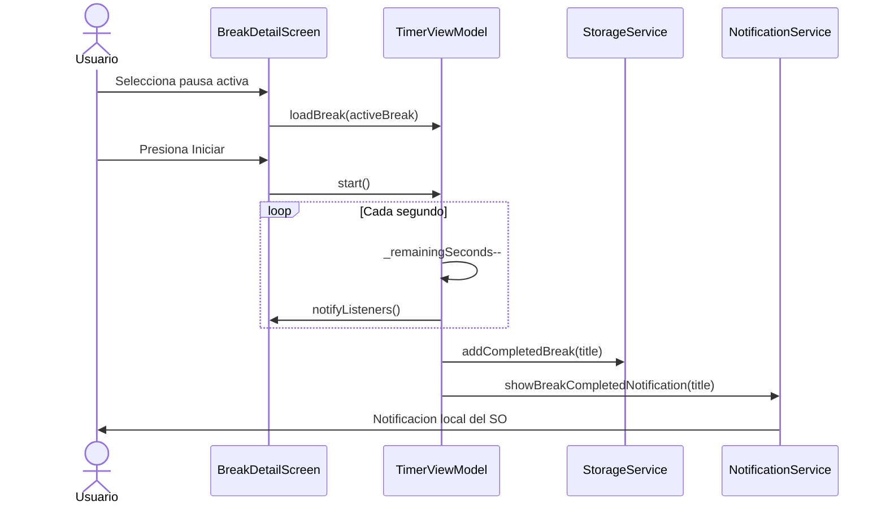
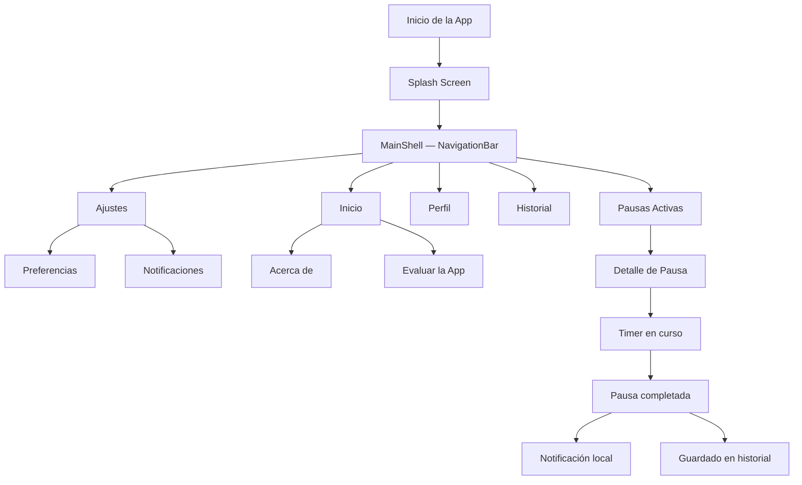

# Active Breaks Mobile
 
## Descripción del proyecto
ActiveBreaks Mobile es una aplicación de productividad orientada a trabajadores y estudiantes que realizan actividades prolongadas frente a pantallas y requieren incorporar pausas activas durante su jornada laboral o de estudio.
 
Muchas personas pasan demasiado tiempo sin pausas activas, lo que puede provocar fatiga física y mental. Esta aplicación propone una solución móvil que permite visualizar una lista de pausas activas recomendadas, ejecutar un temporizador guiado, recibir recordatorios periódicos y registrar el historial de pausas realizadas.
 
El proyecto corresponde a un prototipo funcional programado en Flutter, implementando el patrón de diseño MVVM (Model-View-ViewModel).
 
---
 
## Características
 
- Lista de pausas activas con filtro por categoría.
- Temporizador.
- Notificaciones locales al completar una pausa y recordatorios periódicos configurables.
- Historial de pausas completadas con fecha y hora.
- Perfil de usuario persistido en el dispositivo.
- Compartir pausas con otras aplicaciones del dispositivo.
- Instrumento de evaluación con envío por correo.

---
 
## Requerimientos
 
### Historias de usuario
- Como trabajador, cuando estoy en mi jornada laboral, quiero ver una lista de pausas activas, para elegir la que mejor se ajuste a lo que necesito en ese momento.
- Como usuario, cuando selecciono una pausa activa, quiero ver su detalle y ejecutar un temporizador, para saber cuándo he completado el ejercicio.
- Como usuario, quiero recibir recordatorios periódicos, para no olvidar realizar mis pausas activas durante la jornada.
- Como usuario, quiero ver mi historial de pausas completadas, para llevar un registro de mi bienestar.
- Como usuario, quiero contar con una sección de ayuda, para saber cómo utilizar la aplicación correctamente.
- Como usuario, quiero acceder a una sección de perfil, para visualizar y editar información general sobre mi cuenta.

### Requerimientos funcionales
- La aplicación debe mostrar una lista de pausas activas con filtro por categoría.
- La aplicación debe permitir ejecutar un temporizador al seleccionar una pausa activa.
- La aplicación debe enviar una notificación local al completar una pausa.
- La aplicación debe permitir configurar recordatorios periódicos.
- La aplicación debe persistir el perfil del usuario y el historial de pausas.
- La aplicación debe permitir compartir una pausa activa con otras apps del dispositivo.
- La aplicación debe incluir un instrumento de Beta Testing con envío por correo.

### Requerimientos no funcionales
- La aplicación debe desarrollarse utilizando Flutter y el lenguaje Dart.
- El proyecto debe implementar el patrón MVVM con separación estricta de capas.
- Las versiones del código deben gestionarse mediante Git con ramas por funcionalidad.

---
 
## Arquitectura MVVM
 
El proyecto implementa el patrón **Model-View-ViewModel** utilizando el paquete `provider` para la gestión de estado e inyección de dependencias.
 
### Estructura de capas
 
```
lib/
├── models/           # Entidades del dominio (datos puros, sin lógica)
│   ├── active_break.dart
│   └── beta_question.dart
├── services/         # Acceso a servicios externos y del SO
│   ├── notification_service.dart
│   ├── storage_service.dart
│   └── work_manager_service.dart
├── viewmodels/       # Lógica de negocio y gestión de estado
│   ├── breaks_viewmodel.dart
│   ├── timer_viewmodel.dart
│   ├── profile_viewmodel.dart
│   ├── preferences_viewmodel.dart
│   └── beta_testing_viewmodel.dart
└── screens/          # Interfaz gráfica
    ├── main_shell.dart
    ├── splash_screen.dart
    ├── home_screen.dart
    ├── breaks_list_screen.dart
    ├── break_detail_screen.dart
    ├── profile_screen.dart
    ├── settings_screen.dart
    ├── history_screen.dart
    ├── beta_testing_screen.dart
    └── about_screen.dart
```
 
### Inyección de dependencias
 
Los servicios se instancian en `main.dart` y se inyectan en los ViewModels mediante el constructor. Los ViewModels se exponen a la UI a través de `MultiProvider`:
 
```dart
MultiProvider(
  providers: [
    ChangeNotifierProvider(create: (_) => BreaksViewModel()),
    ChangeNotifierProvider(create: (_) => ProfileViewModel(
      storageService: storageService,
      notificationService: notificationService,
    )),
    ChangeNotifierProvider(create: (_) => TimerViewModel(
      notificationService: notificationService,
      storageService: storageService,
    )),
    ChangeNotifierProvider(create: (_) => BetaTestingViewModel()),
    ChangeNotifierProvider(create: (_) => PreferencesViewModel(
      storageService: storageService,
    )),
  ],
  child: MaterialApp(...),
)
```
 
### Diagrama de arquitectura
 
```
┌─────────────────────────────────────────────────┐
│                    VIEW                         │
│  (Screens — solo llaman a ViewModel, no lógica) │
└────────────────────┬────────────────────────────┘
                     │ context.watch / context.read
┌────────────────────▼────────────────────────────┐
│                 VIEWMODEL                       │
│  (ChangeNotifier — lógica de negocio y estado)  │
└──────────┬──────────────────────┬───────────────┘
           │                      │
┌──────────▼──────────┐  ┌───────▼────────────────┐
│       MODEL         │  │       SERVICES         │
│  (Entidades puras)  │  │  (Storage, Notif, etc) │
└─────────────────────┘  └────────────────────────┘
```
 
---
 
## Diagrama de secuencia — Timer con Notificaciones
 

```mermaid
sequenceDiagram
    actor Usuario
    participant BreakDetailScreen
    participant TimerViewModel
    participant StorageService
    participant NotificationService
 
    Usuario->>BreakDetailScreen: Selecciona pausa activa
    BreakDetailScreen->>TimerViewModel: loadBreak(activeBreak)
    Usuario->>BreakDetailScreen: Presiona Iniciar
    BreakDetailScreen->>TimerViewModel: start()
    loop Cada segundo
        TimerViewModel->>TimerViewModel: _remainingSeconds--
        TimerViewModel->>BreakDetailScreen: notifyListeners()
    end
    TimerViewModel->>StorageService: addCompletedBreak(title)
    TimerViewModel->>NotificationService: showBreakCompletedNotification(title)
    NotificationService->>Usuario: Notificacion local del SO
```
 
---
 
## Diagrama de flujo
 

```mermaid
flowchart TD
    A[Inicio de la App] --> B[Splash Screen]
    B --> C[MainShell — NavigationBar]
    C --> D[Inicio]
    C --> E[Pausas Activas]
    C --> F[Perfil]
    C --> G[Historial]
    C --> H[Ajustes]
    H --> I[Preferencias]
    H --> Q[Notificaciones]
    D --> K[Acerca de]
    D --> J[Evaluar la App]
    E --> L[Detalle de Pausa]
    L --> M[Timer en curso]
    M --> N[Pausa completada]
    N --> O[Notificación local]
    N --> P[Guardado en historial]
```
 
---
 
## Dependencias principales
 
| Paquete | Uso |
|---------|-----|
| `provider`| Gestión de estado MVVM |
| `shared_preferences` | Persistencia de datos |
| `flutter_local_notifications`| Notificaciones locales |
| `share_plus` |Compartir contenido |
| `url_launcher`| Apertura de cliente de correo |
| `permission_handler`| Gestión de permisos |
 
---
 
## Instrucciones de uso
 
1. Al iniciar la aplicación, se muestra una pantalla de splash de bienvenida.
2. Una vez en la app, la navegación principal se realiza mediante la barra inferior (`NavigationBar`), que da acceso a:
   - **Inicio** — dashboard con bienvenida, resumen del usuario, acerca de y evaluación de app.
   - **Pausas** — lista de pausas activas con filtro por categoría.
   - **Perfil** — edición de nombre y rol.
   - **Historial** — registro de pausas completadas con fecha y hora.
   - **Ajustes** — configuración de notificaciones y preferencias de pausas.
3. Al seleccionar una pausa, se accede al detalle y se puede ejecutar el temporizador.
4. Al completar una pausa, se guarda en el historial y se dispara una notificación.
5. Desde el detalle de cada pausa se puede compartir con otras apps del dispositivo.

---
 
## Reporte de QA — Beta Testing
 
### Instrumento de evaluación
 
El instrumento se encuentra en `assets/data/beta_testing.json` y contiene 8 preguntas distribuidas en 3 categorías:
 
- **Usabilidad** (3 preguntas) — navegación, completitud de tareas, interfaz gráfica.
- **Contenido** (3 preguntas) — utilidad, claridad de instrucciones, presentación.
- **Recomendación** (2 preguntas) — probabilidad de recomendar, utilidad para otros.

Cada pregunta se responde con una escala de 1 a 5 estrellas. Al finalizar, la app genera un correo con los resultados y el tipo de usuario (participante del ramo, conocedor de la industria o externo).
 
### Usuarios convocados

| Tipo | Cantidad | Estado |
|------|----------|--------|
| Participantes del ramo | 10 | Completado |
| Conocedores de la industria | 2 | Completado |
| Externos a la industria | 2 | Completado |

### Resultados

Al recopilar todas las respuestas, los resultados por categoría fueron:

| Categoría | Promedio |
|-----------|----------|
| Usabilidad | 4.70 / 5 |
| Contenido | 4.37 / 5 |
| Recomendación | 4.17 / 5 |
| **General** | **4.46 / 5** |

Los resultados por tipo de usuario fueron consistentes entre sí:

| Tipo de usuario | Promedio |
|-----------------|----------|
| Participantes del ramo | 4.40 / 5 |
| Conocedores de la industria | 4.55 / 5 |
| Externos a la industria | 4.50 / 5 |

### Conclusiones y Trabajos Futuros

**Lo que funcionó:**
- La navegación y la capacidad de completar pausas obtuvieron las puntuaciones más altas, lo que demuestra que el flujo principal de la app es intuitivo y funcional.
- La usabilidad fue la categoría mejor evaluada (4.70), validando las decisiones de diseño tomadas con el patrón de navegación por barra inferior.

**Qué falló o puede mejorar:**
- La probabilidad de recomendación fue la pregunta con menor puntuación (3.89), lo que sugiere que la app aún no genera suficiente engagement como para que los usuarios la difundan activamente.
- La utilidad del contenido de las pausas obtuvo una puntuación más baja entre algunos participantes del ramo (3/5 en varios casos), lo que indica que el catálogo de ejercicios podría enriquecerse o personalizarse mejor.

**Trabajos Futuros:**
- Ampliar y diversificar el catálogo de pausas activas con contenido multimedia (videos o animaciones).
- Implementar un sistema de logros o gamificación para aumentar la retención y la probabilidad de recomendación.
- Agregar soporte para múltiples idiomas.
 
---
 
## Videos
 
- **PDS1 — Maqueta funcional:** https://youtu.be/MhweNhE_bj4
- **PDS2 — Prototipo funcional:** https://youtu.be/hjbEhA751xU